# Dokumentasi UML & Perancangan Sistem DewiCiamis
**Sistem Informasi & Reservasi E-Tiket Desa Wisata Kabupaten Ciamis**

Dokumen ini memuat analisis arsitektur, struktur proyek, serta rancangan pemodelan sistem menggunakan diagram Unified Modeling Language (UML), Entity Relationship Diagram (ERD), Logical Record Structure (LRS), dan State Machine Diagram dengan sintaks **Mermaid.js**.

---

## Daftar Isi
1. [Ringkasan Analisis Sistem & Struktur Folder](#1-ringkasan-analisis-sistem--struktur-folder)
2. [Identifikasi Aktor & Hak Akses (Multi-Role: Wisatawan, Pengelola 57 Desa, Admin Dinas)](#2-identifikasi-aktor--hak-akses)
3. [Use Case Diagram](#3-use-case-diagram)
4. [Activity Diagram](#4-activity-diagram)
   - [4.1 Activity Diagram: Pemesanan & Pembayaran Tiket](#41-activity-diagram-pemesanan--pembayaran-tiket)
   - [4.2 Activity Diagram: Verifikasi Pembayaran oleh Admin Dinas](#42-activity-diagram-verifikasi-pembayaran-oleh-admin-dinas)
   - [4.3 Activity Diagram: Manajemen Berita Wisata](#43-activity-diagram-manajemen-berita-wisata)
   - [4.4 Activity Diagram: Pengajuan & Tanggapan Layanan Bantuan](#44-activity-diagram-pengajuan--tanggapan-layanan-bantuan)
   - [4.5 Activity Diagram: Validasi & Scan E-Ticket di Gerbang Masuk oleh Pengelola Desa](#45-activity-diagram-validasi--scan-e-ticket-di-gerbang-masuk-oleh-pengelola-desa)
   - [4.6 Activity Diagram: Rekap & Konfirmasi Pencairan Dana ke Rekening Desa oleh Admin Dinas](#46-activity-diagram-rekap--konfirmasi-pencairan-dana-ke-rekening-desa-oleh-admin-dinas)
5. [Sequence Diagram](#5-sequence-diagram)
   - [5.1 Sequence Diagram: Alur Pemesanan & Pembayaran Tiket](#51-sequence-diagram-alur-pemesanan--pembayaran-tiket)
   - [5.2 Sequence Diagram: Verifikasi Pembayaran oleh Petugas Admin](#52-sequence-diagram-verifikasi-pembayaran-oleh-petugas-admin)
   - [5.3 Sequence Diagram: Penulisan Ulasan & Rating Destinasi](#53-sequence-diagram-penulisan-ulasan--rating-destinasi)
   - [5.4 Sequence Diagram: Validasi E-Ticket di Lokasi Gerbang Desa Wisata](#54-sequence-diagram-validasi-e-ticket-di-lokasi-gerbang-desa-wisata)
   - [5.5 Sequence Diagram: Pengajuan & Konfirmasi Transfer Pencairan Dana Kas Desa](#55-sequence-diagram-pengajuan--konfirmasi-transfer-pencairan-dana-kas-desa)
6. [Class Diagram](#6-class-diagram)
7. [Entity Relationship Diagram (ERD)](#7-entity-relationship-diagram-erd)
8. [Logical Record Structure (LRS)](#8-logical-record-structure-lrs)
9. [State Machine Diagram](#9-state-machine-diagram)
   - [9.1 Siklus Status Pembayaran Tiket](#91-siklus-status-pembayaran-tiket)
   - [9.2 Siklus Tiket Layanan Bantuan](#92-siklus-tiket-layanan-bantuan)
   - [9.3 Siklus Penggunaan Tiket (Check-In Wisatawan)](#93-siklus-penggunaan-tiket-check-in-wisatawan)
   - [9.4 Siklus Status Pencairan Dana Desa](#94-siklus-status-pencairan-dana-desa)
10. [Diagram Konteks & Aliran Data (DFD Level 0)](#10-diagram-konteks--aliran-data-dfd-level-0)

---

## 1. Ringkasan Analisis Sistem & Struktur Folder

Aplikasi **DewiCiamis** dibangun menggunakan arsitektur **Model-View-Controller (MVC)** berbasis framework **Laravel 10**, didukung basis data **MySQL**, antarmuka **Bootstrap 5**, dan pemrosesan filtering interaktif berbasis **JavaScript**.

Sistem menerapkan arsitektur Multi-Auth (3 Guards):
- Guard `web`: Wisatawan / Pengguna Terdaftar (`User.php`)
- Guard `pengelola`: Pengelola 57 Desa Wisata (`PengelolaDesa.php`)
- Guard `admin`: Administrator Dinas Pariwisata (`Admin.php`)

```
Web2-Laravel/
├── app/
│   ├── Http/
│   │   ├── Controllers/
│   │   │   ├── Admin/
│   │   │   │   ├── AuthController.php            # Otentikasi login & logout admin
│   │   │   │   ├── DashboardController.php       # Ringkasan analitik dan metrik penjualan
│   │   │   │   ├── DesaMonitoringController.php  # Monitoring statistik kunjungan & keuangan 57 desa
│   │   │   │   ├── NewsController.php            # CRUD pengelolaan berita wisata
│   │   │   │   ├── OrderController.php           # Verifikasi tiket & manajemen pesanan
│   │   │   │   ├── PencairanDanaController.php   # Rekap & konfirmasi pencairan dana ke rekening desa
│   │   │   │   ├── ProfileController.php         # Pengelolaan kredensial akun admin
│   │   │   │   └── SupportController.php         # Menjawab pesan tiket bantuan pengunjung
│   │   │   ├── Pengelola/
│   │   │   │   ├── AuthController.php            # Login & logout 57 akun pengelola desa
│   │   │   │   ├── DashboardController.php       # Dashboard analitik kunjungan & pendapatan desa
│   │   │   │   ├── DesaController.php            # Edit profil, deskripsi, foto, jam buka, tarif tiket
│   │   │   │   ├── FinanceController.php         # Laporan pendapatan & permohonan pencairan dana
│   │   │   │   └── TicketValidationController.php# Scan & validasi check-in e-ticket di gerbang desa
│   │   │   ├── AuthController.php                # Otentikasi pengunjung (Login, Register, Logout)
│   │   │   ├── DestinationController.php         # Eksplorasi destinasi, detail & ulasan
│   │   │   ├── HomeController.php                # Landing page beranda
│   │   │   ├── NewsController.php                # Halaman publik berita & detail berita
│   │   │   ├── OrderController.php               # Pemesanan, upload bukti bayar, cetak e-tiket
│   │   │   ├── ProfileController.php             # Profil pengguna & riwayat statistik
│   │   │   └── SupportController.php             # FAQ & form tiket bantuan pelanggan
│   ├── Models/
│   │   ├── Admin.php                             # Entitas admin dinas (Guard admin)
│   │   ├── Berita.php                            # Entitas berita wisata
│   │   ├── DesaWisata.php                        # Entitas master 57 Desa Wisata Ciamis
│   │   ├── DestinationPrice.php                  # Entitas harga referensi tiket destinasi
│   │   ├── DestinationReview.php                 # Entitas ulasan & rating pengunjung
│   │   ├── Order.php                             # Entitas pesanan e-tiket, pembayaran & validasi
│   │   ├── PencairanDana.php                     # Entitas permohonan pencairan dana ke kas desa
│   │   ├── PengelolaDesa.php                     # Entitas 57 Akun Pengelola Desa (Guard pengelola)
│   │   ├── SupportFaq.php                        # Entitas master FAQ pusat bantuan
│   │   ├── SupportMessage.php                    # Entitas pengajuan tiket pesan bantuan
│   │   └── User.php                              # Entitas pengguna / wisatawan (Guard web)
```

---

## 2. Identifikasi Aktor & Hak Akses

| Aktor | Deskripsi Hak Akses & Peran |
| :--- | :--- |
| **Pengunjung Umum (Guest)** | Dapat menjelajahi beranda, melihat katalog 57 desa wisata, memfilter per desa/status/kategori, membaca berita, melihat FAQ, melakukan pencarian status tiket dengan kode booking, serta melakukan registrasi akun. |
| **Wisatawan Terdaftar (User / Member)** | Mewarisi hak akses Guest, ditambah kemampuan melakukan pemesanan e-tiket masuk wisata, mengunggah bukti transfer, melihat riwayat e-tiket aktif, mencetak e-tiket ber-QR code, memberikan rating dan ulasan pada destinasi, serta mengelola akun. |
| **Pengelola Desa Wisata (57 Akun Desa)** | Memiliki akun per desa (57 akun total). Hak akses khusus: login ke Panel Pengelola (`/pengelola`), mengedit deskripsi, foto destinasi, jam operasional, hari buka, dan harga tiket masuk desanya sendiri; melakukan scan dan validasi e-ticket saat wisatawan datang ke lokasi gerbang masuk; menginput dan mengelola nomor rekening bank desa / BUMDes; memantau laporan pendapatan tiket desanya sendiri; serta mengajukan pencairan dana ke Dinas Pariwisata. |
| **Petugas Admin Dinas (Dinas Pariwisata)** | Memiliki hak akses penuh ke Panel Admin (`/admin`), mengelola keseluruhan sistem; memantau analitik statistik kunjungan dan pendapatan seluruh 57 desa wisata se-Kabupaten Ciamis; melakukan rekapitulasi dan konfirmasi pencairan dana ke rekening bank masing-masing desa; memverifikasi bukti pembayaran tiket; melakukan CRUD berita pariwisata; dan menjawab tiket bantuan pengunjung. |

---

## 3. Use Case Diagram

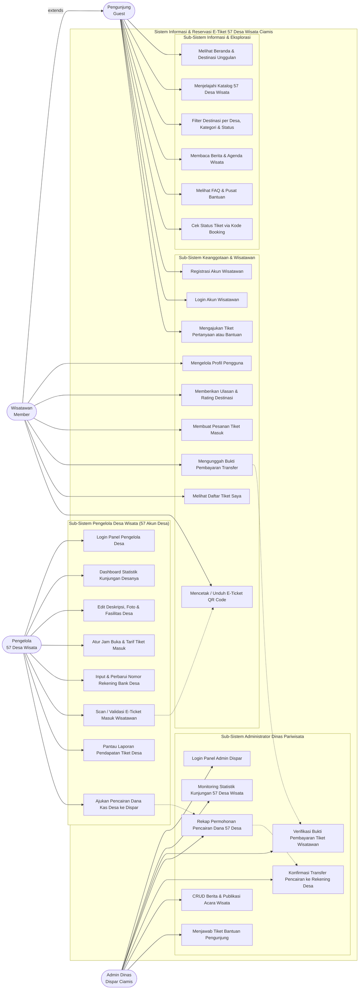
```mermaid
flowchart LR
    Guest(["Pengunjung\nGuest"])
    Member(["Wisatawan\nMember"])
    Pengelola(["Pengelola\n57 Desa Wisata"])
    Admin(["Admin Dinas\nDispar Ciamis"])

    subgraph SI ["Sistem Informasi & Reservasi E-Tiket 57 Desa Wisata Ciamis"]
        subgraph SIE ["Sub-Sistem Informasi & Eksplorasi"]
            UC1["Melihat Beranda & Destinasi Unggulan"]
            UC2["Menjelajahi Katalog 57 Desa Wisata"]
            UC3["Filter Destinasi per Desa, Kategori & Status"]
            UC4["Membaca Berita & Agenda Wisata"]
            UC5["Melihat FAQ & Pusat Bantuan"]
            UC6["Cek Status Tiket via Kode Booking"]
        end

        subgraph SKI ["Sub-Sistem Keanggotaan & Wisatawan"]
            UC7["Registrasi Akun Wisatawan"]
            UC8["Login Akun Wisatawan"]
            UC9["Mengelola Profil Pengguna"]
            UC10["Memberikan Ulasan & Rating Destinasi"]
            UC11["Mengajukan Tiket Pertanyaan atau Bantuan"]
            UC12["Membuat Pesanan Tiket Masuk"]
            UC13["Mengunggah Bukti Pembayaran Transfer"]
            UC14["Melihat Daftar Tiket Saya"]
            UC15["Mencetak / Unduh E-Ticket QR Code"]
        end

        subgraph SPD ["Sub-Sistem Pengelola Desa Wisata (57 Akun Desa)"]
            UC_P1["Login Panel Pengelola Desa"]
            UC_P2["Dashboard Statistik Kunjungan Desanya"]
            UC_P3["Edit Deskripsi, Foto & Fasilitas Desa"]
            UC_P4["Atur Jam Buka & Tarif Tiket Masuk"]
            UC_P5["Input & Perbarui Nomor Rekening Bank Desa"]
            UC_P6["Scan / Validasi E-Ticket Masuk Wisatawan"]
            UC_P7["Pantau Laporan Pendapatan Tiket Desa"]
            UC_P8["Ajukan Pencairan Dana Kas Desa ke Dispar"]
        end

        subgraph SMA ["Sub-Sistem Administrator Dinas Pariwisata"]
            UC_A1["Login Panel Admin Dispar"]
            UC_A2["Monitoring Statistik Kunjungan 57 Desa Wisata"]
            UC_A3["Verifikasi Bukti Pembayaran Tiket Wisatawan"]
            UC_A4["Rekap Permohonan Pencairan Dana 57 Desa"]
            UC_A5["Konfirmasi Transfer Pencairan ke Rekening Desa"]
            UC_A6["CRUD Berita & Publikasi Acara Wisata"]
            UC_A7["Menjawab Tiket Bantuan Pengunjung"]
        end
    end

    %% Relasi Guest
    Guest --> UC1
    Guest --> UC2
    Guest --> UC3
    Guest --> UC4
    Guest --> UC5
    Guest --> UC6
    Guest --> UC7
    Guest --> UC8
    Guest --> UC11

    %% Member extends Guest
    Member -->|extends| Guest
    Member --> UC9
    Member --> UC10
    Member --> UC12
    Member --> UC13
    Member --> UC14
    Member --> UC15

    %% Relasi Pengelola Desa
    Pengelola --> UC_P1
    Pengelola --> UC_P2
    Pengelola --> UC_P3
    Pengelola --> UC_P4
    Pengelola --> UC_P5
    Pengelola --> UC_P6
    Pengelola --> UC_P7
    Pengelola --> UC_P8

    %% Relasi Admin Dinas
    Admin --> UC_A1
    Admin --> UC_A2
    Admin --> UC_A3
    Admin --> UC_A4
    Admin --> UC_A5
    Admin --> UC_A6
    Admin --> UC_A7

    %% Ketergantungan Alur Antar-Aktor
    UC13 -.-> UC_A3
    UC_P6 -.-> UC15
    UC_P8 -.-> UC_A4
    UC_A4 -.-> UC_A5
```

---

## 4. Activity Diagram

### 4.1 Activity Diagram: Pemesanan & Pembayaran Tiket
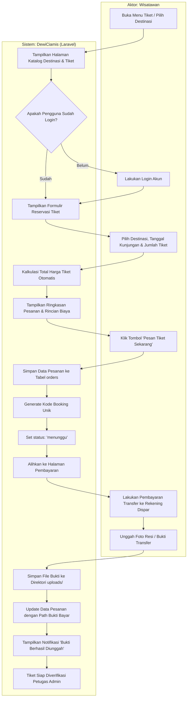
```mermaid
flowchart TD
    subgraph Wisatawan ["Aktor: Wisatawan"]
        A1["Buka Menu Tiket / Pilih Destinasi"]
        A4["Lakukan Login Akun"]
        A6["Pilih Destinasi, Tanggal Kunjungan & Jumlah Tiket"]
        A9["Klik Tombol 'Pesan Tiket Sekarang'"]
        A15["Lakukan Pembayaran Transfer ke Rekening Dispar"]
        A16["Unggah Foto Resi / Bukti Transfer"]
    end

    subgraph Sistem ["Sistem: DewiCiamis (Laravel)"]
        A2["Tampilkan Halaman Katalog Destinasi & Tiket"]
        A3{"Apakah Pengguna Sudah Login?"}
        A5["Tampilkan Formulir Reservasi Tiket"]
        A7["Kalkulasi Total Harga Tiket Otomatis"]
        A8["Tampilkan Ringkasan Pesanan & Rincian Biaya"]
        A10["Simpan Data Pesanan ke Tabel orders"]
        A11["Generate Kode Booking Unik"]
        A12["Set status: 'menunggu'"]
        A13["Alihkan ke Halaman Pembayaran"]
        A17["Simpan File Bukti ke Direktori uploads/"]
        A18["Update Data Pesanan dengan Path Bukti Bayar"]
        A19["Tampilkan Notifikasi 'Bukti Berhasil Diunggah'"]
        A20["Tiket Siap Diverifikasi Petugas Admin"]
    end

    A1 --> A2
    A2 --> A3
    A3 -- "Belum" --> A4
    A4 --> A5
    A3 -- "Sudah" --> A5
    A5 --> A6
    A6 --> A7
    A7 --> A8
    A8 --> A9
    A9 --> A10
    A10 --> A11
    A11 --> A12
    A12 --> A13
    A13 --> A15
    A15 --> A16
    A16 --> A17
    A17 --> A18
    A18 --> A19
    A19 --> A20
```

---

### 4.2 Activity Diagram: Verifikasi Pembayaran oleh Admin Dinas
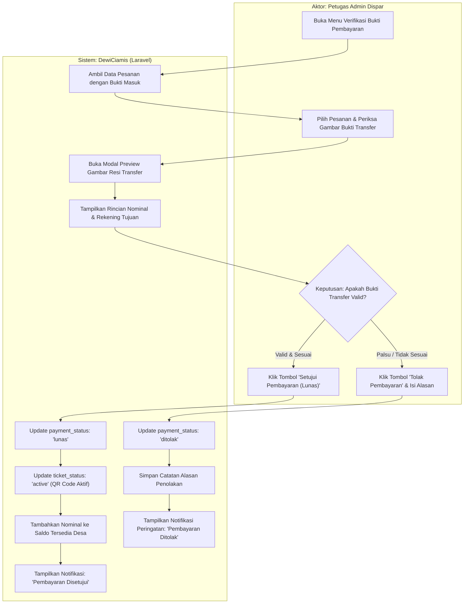
```mermaid
flowchart TD
    subgraph Admin ["Aktor: Petugas Admin Dispar"]
        B1["Buka Menu Verifikasi Bukti Pembayaran"]
        B3["Pilih Pesanan & Periksa Gambar Bukti Transfer"]
        B6{"Keputusan: Apakah Bukti Transfer Valid?"}
        B7["Klik Tombol 'Setujui Pembayaran (Lunas)'"]
        B8["Klik Tombol 'Tolak Pembayaran' & Isi Alasan"]
    end

    subgraph Sistem ["Sistem: DewiCiamis (Laravel)"]
        B2["Ambil Data Pesanan dengan Bukti Masuk"]
        B4["Buka Modal Preview Gambar Resi Transfer"]
        B5["Tampilkan Rincian Nominal & Rekening Tujuan"]
        B9["Update payment_status: 'lunas'"]
        B10["Update ticket_status: 'active' (QR Code Aktif)"]
        B11["Tambahkan Nominal ke Saldo Tersedia Desa"]
        B12["Tampilkan Notifikasi: 'Pembayaran Disetujui'"]
        B13["Update payment_status: 'ditolak'"]
        B14["Simpan Catatan Alasan Penolakan"]
        B15["Tampilkan Notifikasi Peringatan: 'Pembayaran Ditolak'"]
    end

    B1 --> B2
    B2 --> B3
    B3 --> B4
    B4 --> B5
    B5 --> B6
    B6 -- "Valid & Sesuai" --> B7
    B6 -- "Palsu / Tidak Sesuai" --> B8
    B7 --> B9
    B9 --> B10
    B10 --> B11
    B11 --> B12
    B8 --> B13
    B13 --> B14
    B14 --> B15
```

---

### 4.3 Activity Diagram: Manajemen Berita Wisata
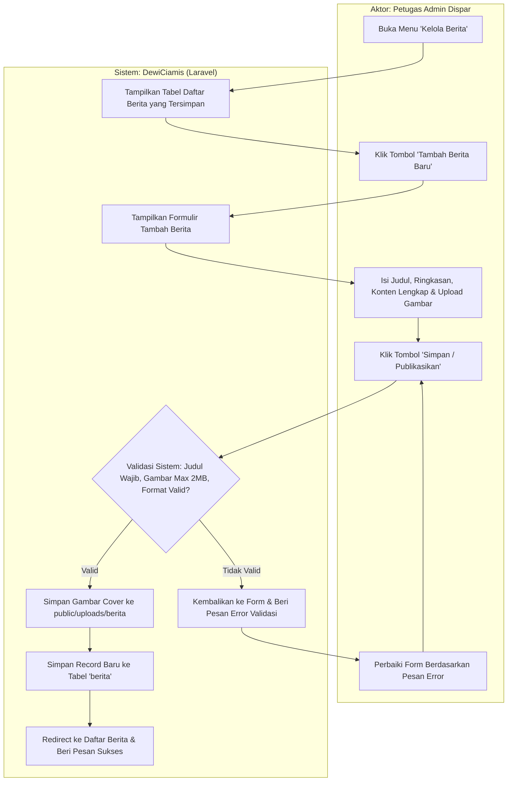
```mermaid
flowchart TD
    subgraph Admin ["Aktor: Petugas Admin Dispar"]
        C1["Buka Menu 'Kelola Berita'"]
        C3["Klik Tombol 'Tambah Berita Baru'"]
        C5["Isi Judul, Ringkasan, Konten Lengkap & Upload Gambar"]
        C6["Klik Tombol 'Simpan / Publikasikan'"]
        C11["Perbaiki Form Berdasarkan Pesan Error"]
    end

    subgraph Sistem ["Sistem: DewiCiamis (Laravel)"]
        C2["Tampilkan Tabel Daftar Berita yang Tersimpan"]
        C4["Tampilkan Formulir Tambah Berita"]
        C7{"Validasi Sistem: Judul Wajib, Gambar Max 2MB, Format Valid?"}
        C8["Simpan Gambar Cover ke public/uploads/berita"]
        C9["Simpan Record Baru ke Tabel 'berita'"]
        C10["Redirect ke Daftar Berita & Beri Pesan Sukses"]
        C12["Kembalikan ke Form & Beri Pesan Error Validasi"]
    end

    C1 --> C2
    C2 --> C3
    C3 --> C4
    C4 --> C5
    C5 --> C6
    C6 --> C7
    C7 -- "Valid" --> C8
    C8 --> C9
    C9 --> C10
    C7 -- "Tidak Valid" --> C12
    C12 --> C11
    C11 --> C6
```

---

### 4.4 Activity Diagram: Pengajuan & Tanggapan Layanan Bantuan
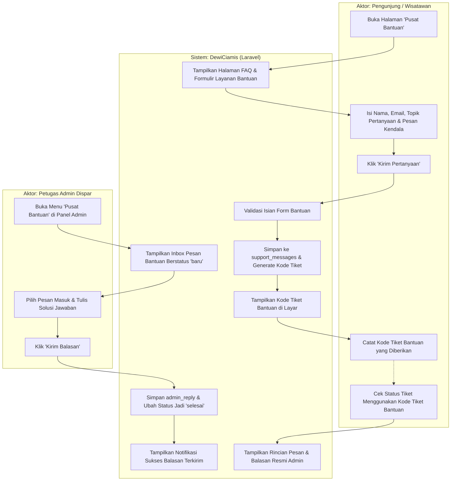
```mermaid
flowchart TD
    subgraph Pengunjung ["Aktor: Pengunjung / Wisatawan"]
        D1["Buka Halaman 'Pusat Bantuan'"]
        D3["Isi Nama, Email, Topik Pertanyaan & Pesan Kendala"]
        D4["Klik 'Kirim Pertanyaan'"]
        D7["Catat Kode Tiket Bantuan yang Diberikan"]
        D15["Cek Status Tiket Menggunakan Kode Tiket Bantuan"]
    end

    subgraph Sistem ["Sistem: DewiCiamis (Laravel)"]
        D2["Tampilkan Halaman FAQ & Formulir Layanan Bantuan"]
        D5["Validasi Isian Form Bantuan"]
        D6["Simpan ke support_messages & Generate Kode Tiket"]
        D8["Tampilkan Kode Tiket Bantuan di Layar"]
        D10["Tampilkan Inbox Pesan Bantuan Berstatus 'baru'"]
        D13["Simpan admin_reply & Ubah Status Jadi 'selesai'"]
        D14["Tampilkan Notifikasi Sukses Balasan Terkirim"]
        D16["Tampilkan Rincian Pesan & Balasan Resmi Admin"]
    end

    subgraph Admin ["Aktor: Petugas Admin Dispar"]
        D9["Buka Menu 'Pusat Bantuan' di Panel Admin"]
        D11["Pilih Pesan Masuk & Tulis Solusi Jawaban"]
        D12["Klik 'Kirim Balasan'"]
    end

    D1 --> D2
    D2 --> D3
    D3 --> D4
    D4 --> D5
    D5 --> D6
    D6 --> D8
    D8 --> D7
    D9 --> D10
    D10 --> D11
    D11 --> D12
    D12 --> D13
    D13 --> D14
    D7 -.-> D15
    D15 --> D16
```

---

### 4.5 Activity Diagram: Validasi & Scan E-Ticket di Gerbang Masuk oleh Pengelola Desa
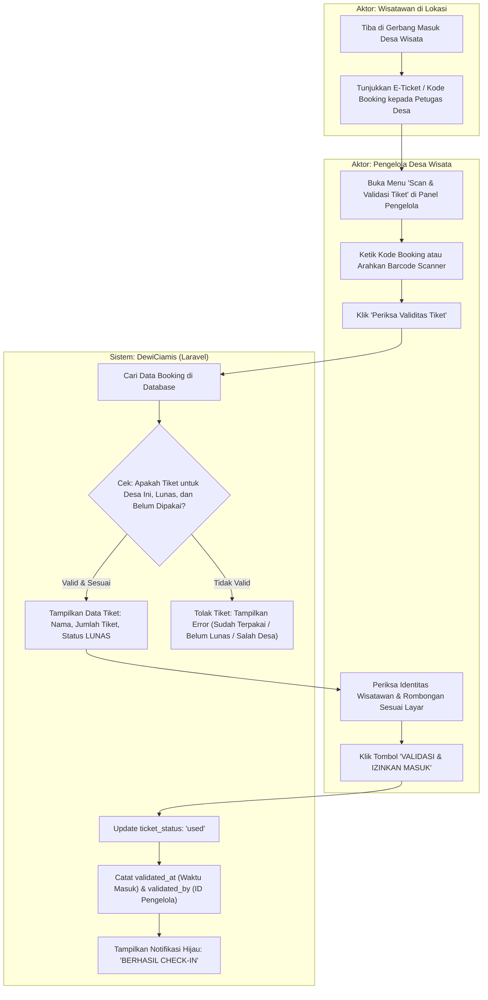
```mermaid
flowchart TD
    subgraph Wisatawan ["Aktor: Wisatawan di Lokasi"]
        E1["Tiba di Gerbang Masuk Desa Wisata"]
        E2["Tunjukkan E-Ticket / Kode Booking kepada Petugas Desa"]
    end

    subgraph Pengelola ["Aktor: Pengelola Desa Wisata"]
        E3["Buka Menu 'Scan & Validasi Tiket' di Panel Pengelola"]
        E4["Ketik Kode Booking atau Arahkan Barcode Scanner"]
        E5["Klik 'Periksa Validitas Tiket'"]
        E9["Periksa Identitas Wisatawan & Rombongan Sesuai Layar"]
        E10["Klik Tombol 'VALIDASI & IZINKAN MASUK'"]
    end

    subgraph Sistem ["Sistem: DewiCiamis (Laravel)"]
        E6["Cari Data Booking di Database"]
        E7{"Cek: Apakah Tiket untuk Desa Ini, Lunas, dan Belum Dipakai?"}
        E8["Tampilkan Data Tiket: Nama, Jumlah Tiket, Status LUNAS"]
        E11["Update ticket_status: 'used'"]
        E12["Catat validated_at (Waktu Masuk) & validated_by (ID Pengelola)"]
        E13["Tampilkan Notifikasi Hijau: 'BERHASIL CHECK-IN'"]
        E14["Tolak Tiket: Tampilkan Error (Sudah Terpakai / Belum Lunas / Salah Desa)"]
    end

    E1 --> E2
    E2 --> E3
    E3 --> E4
    E4 --> E5
    E5 --> E6
    E6 --> E7
    E7 -- "Valid & Sesuai" --> E8
    E7 -- "Tidak Valid" --> E14
    E8 --> E9
    E9 --> E10
    E10 --> E11
    E11 --> E12
    E12 --> E13
```

---

### 4.6 Activity Diagram: Rekap & Konfirmasi Pencairan Dana ke Rekening Desa oleh Admin Dinas
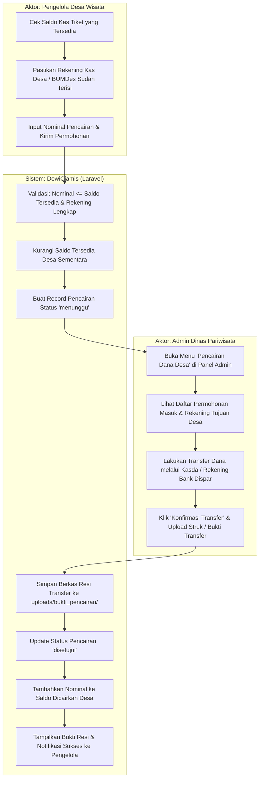
```mermaid
flowchart TD
    subgraph Pengelola ["Aktor: Pengelola Desa Wisata"]
        F1["Cek Saldo Kas Tiket yang Tersedia"]
        F2["Pastikan Rekening Kas Desa / BUMDes Sudah Terisi"]
        F3["Input Nominal Pencairan & Kirim Permohonan"]
    end

    subgraph Admin ["Aktor: Admin Dinas Pariwisata"]
        F7["Buka Menu 'Pencairan Dana Desa' di Panel Admin"]
        F8["Lihat Daftar Permohonan Masuk & Rekening Tujuan Desa"]
        F9["Lakukan Transfer Dana melalui Kasda / Rekening Bank Dispar"]
        F10["Klik 'Konfirmasi Transfer' & Upload Struk / Bukti Transfer"]
    end

    subgraph Sistem ["Sistem: DewiCiamis (Laravel)"]
        F4["Validasi: Nominal <= Saldo Tersedia & Rekening Lengkap"]
        F5["Kurangi Saldo Tersedia Desa Sementara"]
        F6["Buat Record Pencairan Status 'menunggu'"]
        F11["Simpan Berkas Resi Transfer ke uploads/bukti_pencairan/"]
        F12["Update Status Pencairan: 'disetujui'"]
        F13["Tambahkan Nominal ke Saldo Dicairkan Desa"]
        F14["Tampilkan Bukti Resi & Notifikasi Sukses ke Pengelola"]
    end

    F1 --> F2
    F2 --> F3
    F3 --> F4
    F4 --> F5
    F5 --> F6
    F6 --> F7
    F7 --> F8
    F8 --> F9
    F9 --> F10
    F10 --> F11
    F11 --> F12
    F12 --> F13
    F13 --> F14
```

---

## 5. Sequence Diagram

### 5.1 Sequence Diagram: Alur Pemesanan & Pembayaran Tiket
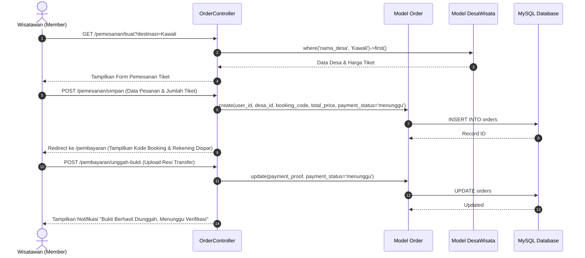
```mermaid
sequenceDiagram
    autonumber
    actor W as Wisatawan (Member)
    participant C as OrderController
    participant O as Model Order
    participant D as Model DesaWisata
    participant DB as MySQL Database

    W->>C: GET /pemesanan/buat?destinasi=Kawali
    C->>D: where('nama_desa', 'Kawali')->first()
    D-->>C: Data Desa & Harga Tiket
    C-->>W: Tampilkan Form Pemesanan Tiket

    W->>C: POST /pemesanan/simpan (Data Pesanan & Jumlah Tiket)
    C->>O: create(user_id, desa_id, booking_code, total_price, payment_status='menunggu')
    O->>DB: INSERT INTO orders
    DB-->>O: Record ID
    C-->>W: Redirect ke /pembayaran (Tampilkan Kode Booking & Rekening Dispar)

    W->>C: POST /pembayaran/unggah-bukti (Upload Resi Transfer)
    C->>O: update(payment_proof, payment_status='menunggu')
    O->>DB: UPDATE orders
    DB-->>O: Updated
    C-->>W: Tampilkan Notifikasi "Bukti Berhasil Diunggah, Menunggu Verifikasi"
```

---

### 5.2 Sequence Diagram: Verifikasi Pembayaran oleh Petugas Admin
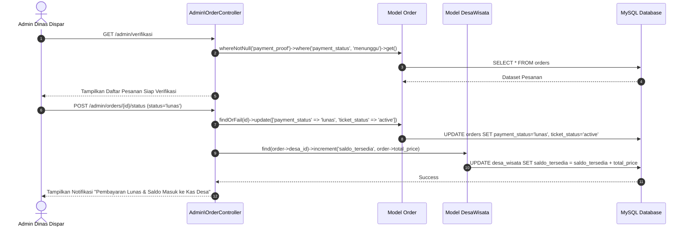
```mermaid
sequenceDiagram
    autonumber
    actor A as Admin Dinas Dispar
    participant C as Admin\OrderController
    participant O as Model Order
    participant D as Model DesaWisata
    participant DB as MySQL Database

    A->>C: GET /admin/verifikasi
    C->>O: whereNotNull('payment_proof')->where('payment_status', 'menunggu')->get()
    O->>DB: SELECT * FROM orders
    DB-->>O: Dataset Pesanan
    C-->>A: Tampilkan Daftar Pesanan Siap Verifikasi

    A->>C: POST /admin/orders/{id}/status (status='lunas')
    C->>O: findOrFail(id)->update(['payment_status' => 'lunas', 'ticket_status' => 'active'])
    O->>DB: UPDATE orders SET payment_status='lunas', ticket_status='active'
    C->>D: find(order->desa_id)->increment('saldo_tersedia', order->total_price)
    D->>DB: UPDATE desa_wisata SET saldo_tersedia = saldo_tersedia + total_price
    DB-->>C: Success
    C-->>A: Tampilkan Notifikasi "Pembayaran Lunas & Saldo Masuk ke Kas Desa"
```

---

### 5.3 Sequence Diagram: Penulisan Ulasan & Rating Destinasi
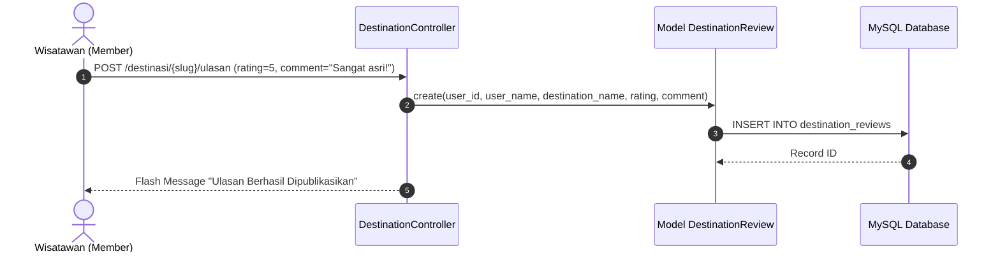
```mermaid
sequenceDiagram
    autonumber
    actor W as Wisatawan (Member)
    participant C as DestinationController
    participant R as Model DestinationReview
    participant DB as MySQL Database

    W->>C: POST /destinasi/{slug}/ulasan (rating=5, comment="Sangat asri!")
    C->>R: create(user_id, user_name, destination_name, rating, comment)
    R->>DB: INSERT INTO destination_reviews
    DB-->>R: Record ID
    C-->>W: Flash Message "Ulasan Berhasil Dipublikasikan"
```

---

### 5.4 Sequence Diagram: Validasi E-Ticket di Lokasi Gerbang Desa Wisata
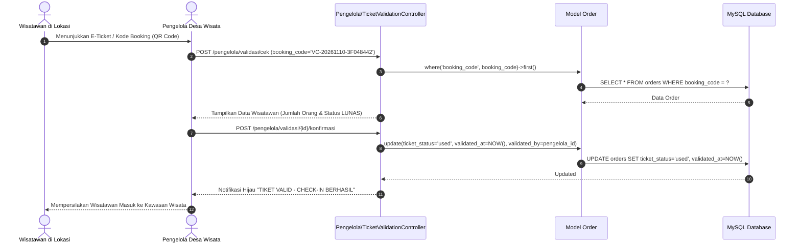
```mermaid
sequenceDiagram
    autonumber
    actor W as Wisatawan di Lokasi
    actor P as Pengelola Desa Wisata
    participant C as Pengelola\TicketValidationController
    participant O as Model Order
    participant DB as MySQL Database

    W->>P: Menunjukkan E-Ticket / Kode Booking (QR Code)
    P->>C: POST /pengelola/validasi/cek (booking_code='VC-20261110-3F048442')
    C->>O: where('booking_code', booking_code)->first()
    O->>DB: SELECT * FROM orders WHERE booking_code = ?
    DB-->>O: Data Order
    C-->>P: Tampilkan Data Wisatawan (Jumlah Orang & Status LUNAS)

    P->>C: POST /pengelola/validasi/{id}/konfirmasi
    C->>O: update(ticket_status='used', validated_at=NOW(), validated_by=pengelola_id)
    O->>DB: UPDATE orders SET ticket_status='used', validated_at=NOW()
    DB-->>C: Updated
    C-->>P: Notifikasi Hijau "TIKET VALID - CHECK-IN BERHASIL"
    P-->>W: Mempersilakan Wisatawan Masuk ke Kawasan Wisata
```

---

### 5.5 Sequence Diagram: Pengajuan & Konfirmasi Transfer Pencairan Dana Kas Desa
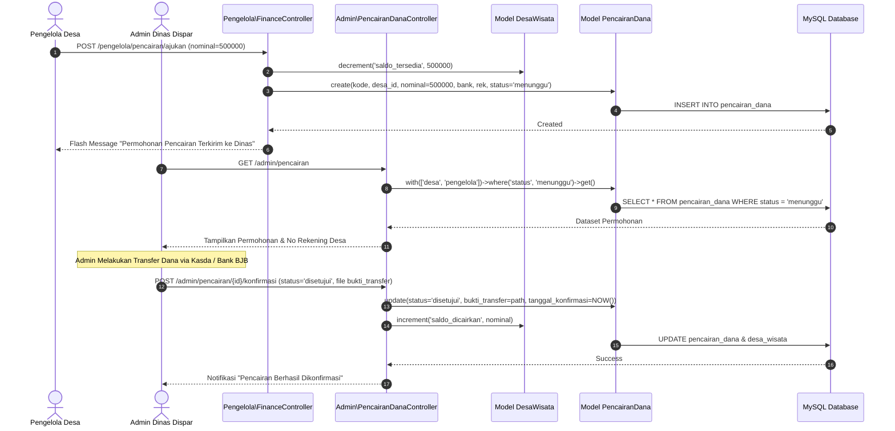
```mermaid
sequenceDiagram
    autonumber
    actor P as Pengelola Desa
    actor A as Admin Dinas Dispar
    participant FC as Pengelola\FinanceController
    participant AC as Admin\PencairanDanaController
    participant D as Model DesaWisata
    participant W as Model PencairanDana
    participant DB as MySQL Database

    P->>FC: POST /pengelola/pencairan/ajukan (nominal=500000)
    FC->>D: decrement('saldo_tersedia', 500000)
    FC->>W: create(kode, desa_id, nominal=500000, bank, rek, status='menunggu')
    W->>DB: INSERT INTO pencairan_dana
    DB-->>FC: Created
    FC-->>P: Flash Message "Permohonan Pencairan Terkirim ke Dinas"

    A->>AC: GET /admin/pencairan
    AC->>W: with(['desa', 'pengelola'])->where('status', 'menunggu')->get()
    W->>DB: SELECT * FROM pencairan_dana WHERE status = 'menunggu'
    DB-->>AC: Dataset Permohonan
    AC-->>A: Tampilkan Permohonan & No Rekening Desa

    Note over A: Admin Melakukan Transfer Dana via Kasda / Bank BJB

    A->>AC: POST /admin/pencairan/{id}/konfirmasi (status='disetujui', file bukti_transfer)
    AC->>W: update(status='disetujui', bukti_transfer=path, tanggal_konfirmasi=NOW())
    AC->>D: increment('saldo_dicairkan', nominal)
    W->>DB: UPDATE pencairan_dana & desa_wisata
    DB-->>AC: Success
    AC-->>A: Notifikasi "Pencairan Berhasil Dikonfirmasi"
```

---

## 6. Class Diagram

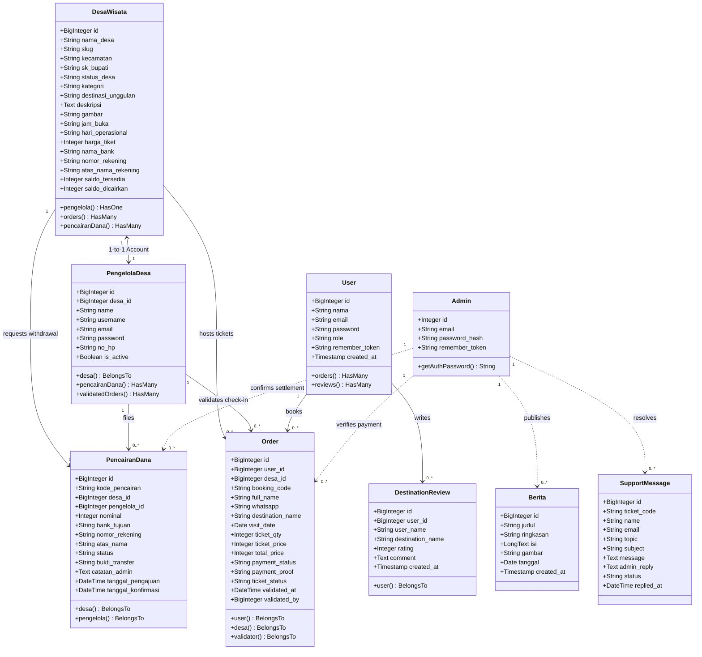
```mermaid
classDiagram
    direction TB

    class User {
        +BigInteger id
        +String nama
        +String email
        +String password
        +String role
        +String remember_token
        +Timestamp created_at
        +orders() HasMany
        +reviews() HasMany
    }

    class PengelolaDesa {
        +BigInteger id
        +BigInteger desa_id
        +String name
        +String username
        +String email
        +String password
        +String no_hp
        +Boolean is_active
        +desa() BelongsTo
        +pencairanDana() HasMany
        +validatedOrders() HasMany
    }

    class DesaWisata {
        +BigInteger id
        +String nama_desa
        +String slug
        +String kecamatan
        +String sk_bupati
        +String status_desa
        +String kategori
        +String destinasi_unggulan
        +Text deskripsi
        +String gambar
        +String jam_buka
        +String hari_operasional
        +Integer harga_tiket
        +String nama_bank
        +String nomor_rekening
        +String atas_nama_rekening
        +Integer saldo_tersedia
        +Integer saldo_dicairkan
        +pengelola() HasOne
        +orders() HasMany
        +pencairanDana() HasMany
    }

    class PencairanDana {
        +BigInteger id
        +String kode_pencairan
        +BigInteger desa_id
        +BigInteger pengelola_id
        +Integer nominal
        +String bank_tujuan
        +String nomor_rekening
        +String atas_nama
        +String status
        +String bukti_transfer
        +Text catatan_admin
        +DateTime tanggal_pengajuan
        +DateTime tanggal_konfirmasi
        +desa() BelongsTo
        +pengelola() BelongsTo
    }

    class Admin {
        +Integer id
        +String email
        +String password_hash
        +String remember_token
        +getAuthPassword() String
    }

    class Order {
        +BigInteger id
        +BigInteger user_id
        +BigInteger desa_id
        +String booking_code
        +String full_name
        +String whatsapp
        +String destination_name
        +Date visit_date
        +Integer ticket_qty
        +Integer ticket_price
        +Integer total_price
        +String payment_status
        +String payment_proof
        +String ticket_status
        +DateTime validated_at
        +BigInteger validated_by
        +user() BelongsTo
        +desa() BelongsTo
        +validator() BelongsTo
    }

    class DestinationReview {
        +BigInteger id
        +BigInteger user_id
        +String user_name
        +String destination_name
        +Integer rating
        +Text comment
        +Timestamp created_at
        +user() BelongsTo
    }

    class Berita {
        +BigInteger id
        +String judul
        +String ringkasan
        +LongText isi
        +String gambar
        +Date tanggal
        +Timestamp created_at
    }

    class SupportMessage {
        +BigInteger id
        +String ticket_code
        +String name
        +String email
        +String topic
        +String subject
        +Text message
        +Text admin_reply
        +String status
        +DateTime replied_at
    }

    %% Relasi Antar Kelas
    DesaWisata "1" <--> "1" PengelolaDesa : 1-to-1 Account
    DesaWisata "1" --> "0..*" Order : hosts tickets
    DesaWisata "1" --> "0..*" PencairanDana : requests withdrawal
    PengelolaDesa "1" --> "0..*" PencairanDana : files
    PengelolaDesa "1" --> "0..*" Order : validates check-in
    User "1" --> "0..*" Order : books
    User "1" --> "0..*" DestinationReview : writes
    Admin "1" ..> "0..*" Order : verifies payment
    Admin "1" ..> "0..*" PencairanDana : confirms settlement
    Admin "1" ..> "0..*" Berita : publishes
    Admin "1" ..> "0..*" SupportMessage : resolves
```

---

## 7. Entity Relationship Diagram (ERD)

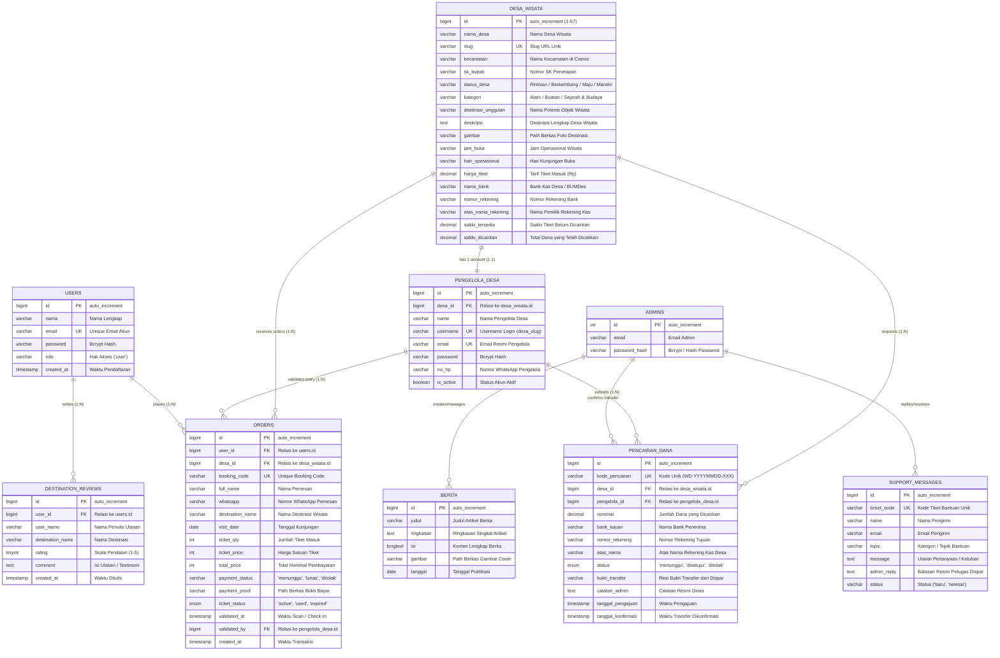
```mermaid
erDiagram
    DESA_WISATA ||--|| PENGELOLA_DESA : "has 1 account (1:1)"
    DESA_WISATA ||--o{ ORDERS : "receives orders (1:N)"
    DESA_WISATA ||--o{ PENCAIRAN_DANA : "requests (1:N)"
    PENGELOLA_DESA ||--o{ PENCAIRAN_DANA : "submits (1:N)"
    PENGELOLA_DESA ||--o{ ORDERS : "validates entry (1:N)"
    USERS ||--o{ ORDERS : "places (1:N)"
    USERS ||--o{ DESTINATION_REVIEWS : "writes (1:N)"
    ADMINS ||--o{ BERITA : "creates/manages"
    ADMINS ||--o{ SUPPORT_MESSAGES : "replies/resolves"
    ADMINS ||--o{ PENCAIRAN_DANA : "confirms transfer"

    DESA_WISATA {
        bigint id PK "auto_increment (1-57)"
        varchar nama_desa "Nama Desa Wisata"
        varchar slug UK "Slug URL Unik"
        varchar kecamatan "Nama Kecamatan di Ciamis"
        varchar sk_bupati "Nomor SK Penetapan"
        varchar status_desa "Rintisan / Berkembang / Maju / Mandiri"
        varchar kategori "Alam / Buatan / Sejarah & Budaya"
        varchar destinasi_unggulan "Nama Potensi Objek Wisata"
        text deskripsi "Deskripsi Lengkap Desa Wisata"
        varchar gambar "Path Berkas Foto Destinasi"
        varchar jam_buka "Jam Operasional Wisata"
        varchar hari_operasional "Hari Kunjungan Buka"
        decimal harga_tiket "Tarif Tiket Masuk (Rp)"
        varchar nama_bank "Bank Kas Desa / BUMDes"
        varchar nomor_rekening "Nomor Rekening Bank"
        varchar atas_nama_rekening "Nama Pemilik Rekening Kas"
        decimal saldo_tersedia "Saldo Tiket Belum Dicairkan"
        decimal saldo_dicairkan "Total Dana yang Telah Dicairkan"
    }

    PENGELOLA_DESA {
        bigint id PK "auto_increment"
        bigint desa_id FK "Relasi ke desa_wisata.id"
        varchar name "Nama Pengelola Desa"
        varchar username UK "Username Login (desa_slug)"
        varchar email UK "Email Resmi Pengelola"
        varchar password "Bcrypt Hash"
        varchar no_hp "Nomor WhatsApp Pengelola"
        boolean is_active "Status Akun Aktif"
    }

    PENCAIRAN_DANA {
        bigint id PK "auto_increment"
        varchar kode_pencairan UK "Kode Unik (WD-YYYYMMDD-XXX)"
        bigint desa_id FK "Relasi ke desa_wisata.id"
        bigint pengelola_id FK "Relasi ke pengelola_desa.id"
        decimal nominal "Jumlah Dana yang Dicairkan"
        varchar bank_tujuan "Nama Bank Penerima"
        varchar nomor_rekening "Nomor Rekening Tujuan"
        varchar atas_nama "Atas Nama Rekening Kas Desa"
        enum status "'menunggu', 'disetujui', 'ditolak'"
        varchar bukti_transfer "Resi Bukti Transfer dari Dispar"
        text catatan_admin "Catatan Resmi Dinas"
        timestamp tanggal_pengajuan "Waktu Pengajuan"
        timestamp tanggal_konfirmasi "Waktu Transfer Dikonfirmasi"
    }

    USERS {
        bigint id PK "auto_increment"
        varchar nama "Nama Lengkap"
        varchar email UK "Unique Email Akun"
        varchar password "Bcrypt Hash"
        varchar role "Hak Akses ('user')"
        timestamp created_at "Waktu Pendaftaran"
    }

    ADMINS {
        int id PK "auto_increment"
        varchar email "Email Admin"
        varchar password_hash "Bcrypt / Hash Password"
    }

    ORDERS {
        bigint id PK "auto_increment"
        bigint user_id FK "Relasi ke users.id"
        bigint desa_id FK "Relasi ke desa_wisata.id"
        varchar booking_code UK "Unique Booking Code"
        varchar full_name "Nama Pemesan"
        varchar whatsapp "Nomor WhatsApp Pemesan"
        varchar destination_name "Nama Destinasi Wisata"
        date visit_date "Tanggal Kunjungan"
        int ticket_qty "Jumlah Tiket Masuk"
        int ticket_price "Harga Satuan Tiket"
        int total_price "Total Nominal Pembayaran"
        varchar payment_status "'menunggu', 'lunas', 'ditolak'"
        varchar payment_proof "Path Berkas Bukti Bayar"
        enum ticket_status "'active', 'used', 'expired'"
        timestamp validated_at "Waktu Scan / Check-In"
        bigint validated_by FK "Relasi ke pengelola_desa.id"
        timestamp created_at "Waktu Transaksi"
    }

    DESTINATION_REVIEWS {
        bigint id PK "auto_increment"
        bigint user_id FK "Relasi ke users.id"
        varchar user_name "Nama Penulis Ulasan"
        varchar destination_name "Nama Destinasi"
        tinyint rating "Skala Penilaian (1-5)"
        text comment "Isi Ulasan / Testimoni"
        timestamp created_at "Waktu Ditulis"
    }

    BERITA {
        bigint id PK "auto_increment"
        varchar judul "Judul Artikel Berita"
        text ringkasan "Ringkasan Singkat Artikel"
        longtext isi "Konten Lengkap Berita"
        varchar gambar "Path Berkas Gambar Cover"
        date tanggal "Tanggal Publikasi"
    }

    SUPPORT_MESSAGES {
        bigint id PK "auto_increment"
        varchar ticket_code UK "Kode Tiket Bantuan Unik"
        varchar name "Nama Pengirim"
        varchar email "Email Pengirim"
        varchar topic "Kategori / Topik Bantuan"
        text message "Uraian Pertanyaan / Keluhan"
        text admin_reply "Balasan Resmi Petugas Dispar"
        varchar status "Status ('baru', 'selesai')"
    }
```

---

## 8. Logical Record Structure (LRS)

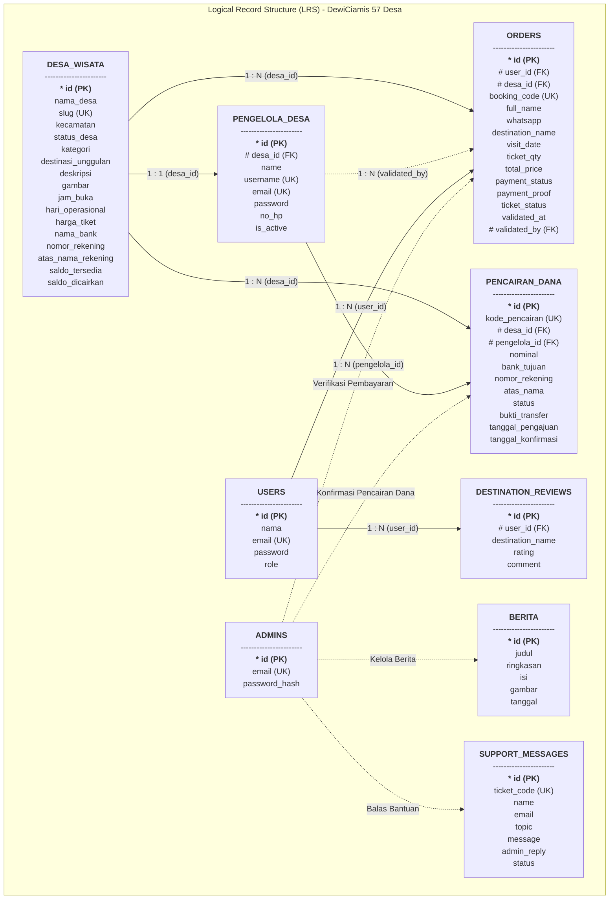
```mermaid
graph TD
    subgraph LRS ["Logical Record Structure (LRS) - DewiCiamis 57 Desa"]
        DESA["<b>DESA_WISATA</b><br/>-----------------------<br/><b>* id (PK)</b><br/>nama_desa<br/>slug (UK)<br/>kecamatan<br/>status_desa<br/>kategori<br/>destinasi_unggulan<br/>deskripsi<br/>gambar<br/>jam_buka<br/>hari_operasional<br/>harga_tiket<br/>nama_bank<br/>nomor_rekening<br/>atas_nama_rekening<br/>saldo_tersedia<br/>saldo_dicairkan"]

        PENGELOLA["<b>PENGELOLA_DESA</b><br/>-----------------------<br/><b>* id (PK)</b><br/># desa_id (FK)<br/>name<br/>username (UK)<br/>email (UK)<br/>password<br/>no_hp<br/>is_active"]

        PENCAIRAN["<b>PENCAIRAN_DANA</b><br/>-----------------------<br/><b>* id (PK)</b><br/>kode_pencairan (UK)<br/># desa_id (FK)<br/># pengelola_id (FK)<br/>nominal<br/>bank_tujuan<br/>nomor_rekening<br/>atas_nama<br/>status<br/>bukti_transfer<br/>tanggal_pengajuan<br/>tanggal_konfirmasi"]

        USERS["<b>USERS</b><br/>-----------------------<br/><b>* id (PK)</b><br/>nama<br/>email (UK)<br/>password<br/>role"]

        ORDERS["<b>ORDERS</b><br/>-----------------------<br/><b>* id (PK)</b><br/># user_id (FK)<br/># desa_id (FK)<br/>booking_code (UK)<br/>full_name<br/>whatsapp<br/>destination_name<br/>visit_date<br/>ticket_qty<br/>total_price<br/>payment_status<br/>payment_proof<br/>ticket_status<br/>validated_at<br/># validated_by (FK)"]

        REVIEWS["<b>DESTINATION_REVIEWS</b><br/>-----------------------<br/><b>* id (PK)</b><br/># user_id (FK)<br/>destination_name<br/>rating<br/>comment"]

        ADMINS["<b>ADMINS</b><br/>-----------------------<br/><b>* id (PK)</b><br/>email (UK)<br/>password_hash"]

        BERITA["<b>BERITA</b><br/>-----------------------<br/><b>* id (PK)</b><br/>judul<br/>ringkasan<br/>isi<br/>gambar<br/>tanggal"]

        SUPPORT["<b>SUPPORT_MESSAGES</b><br/>-----------------------<br/><b>* id (PK)</b><br/>ticket_code (UK)<br/>name<br/>email<br/>topic<br/>message<br/>admin_reply<br/>status"]
    end

    %% Kardinalitas Relasi
    DESA -- "1 : 1 (desa_id)" --> PENGELOLA
    DESA -- "1 : N (desa_id)" --> ORDERS
    DESA -- "1 : N (desa_id)" --> PENCAIRAN
    PENGELOLA -- "1 : N (pengelola_id)" --> PENCAIRAN
    PENGELOLA -. "1 : N (validated_by)" .-> ORDERS
    USERS -- "1 : N (user_id)" --> ORDERS
    USERS -- "1 : N (user_id)" --> REVIEWS
    ADMINS -. "Verifikasi Pembayaran" .-> ORDERS
    ADMINS -. "Konfirmasi Pencairan Dana" .-> PENCAIRAN
    ADMINS -. "Kelola Berita" .-> BERITA
    ADMINS -. "Balas Bantuan" .-> SUPPORT
```

---

## 9. State Machine Diagram

### 9.1 Siklus Status Pembayaran Tiket
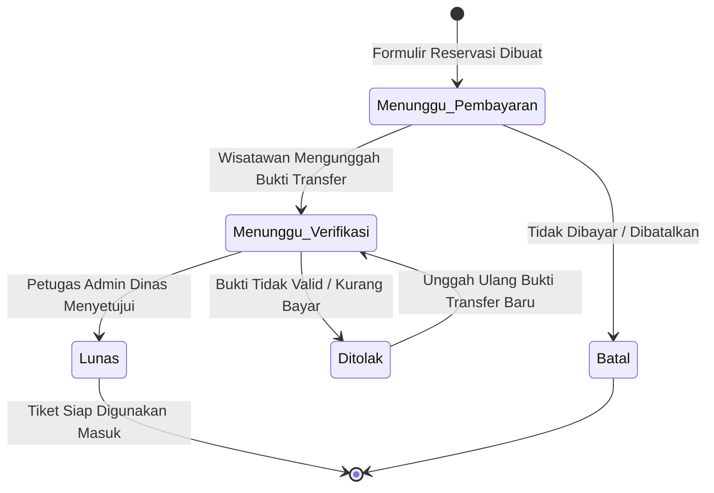
```mermaid
stateDiagram-v2
    [*] --> Menunggu_Pembayaran : Formulir Reservasi Dibuat
    Menunggu_Pembayaran --> Menunggu_Verifikasi : Wisatawan Mengunggah Bukti Transfer
    Menunggu_Pembayaran --> Batal : Tidak Dibayar / Dibatalkan
    Menunggu_Verifikasi --> Lunas : Petugas Admin Dinas Menyetujui
    Menunggu_Verifikasi --> Ditolak : Bukti Tidak Valid / Kurang Bayar
    Ditolak --> Menunggu_Verifikasi : Unggah Ulang Bukti Transfer Baru
    Lunas --> [*] : Tiket Siap Digunakan Masuk
    Batal --> [*]
```

---

### 9.2 Siklus Tiket Layanan Bantuan
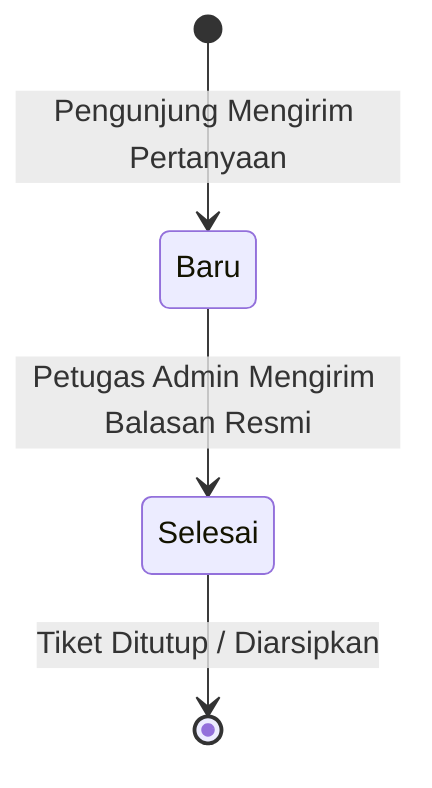
```mermaid
stateDiagram-v2
    [*] --> Baru : Pengunjung Mengirim Pertanyaan
    Baru --> Selesai : Petugas Admin Mengirim Balasan Resmi
    Selesai --> [*] : Tiket Ditutup / Diarsipkan
```

---

### 9.3 Siklus Penggunaan Tiket (Check-In Wisatawan)
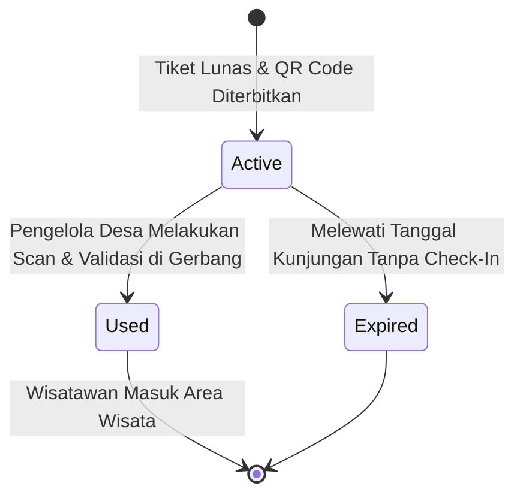
```mermaid
stateDiagram-v2
    [*] --> Active : Tiket Lunas & QR Code Diterbitkan
    Active --> Used : Pengelola Desa Melakukan Scan & Validasi di Gerbang
    Active --> Expired : Melewati Tanggal Kunjungan Tanpa Check-In
    Used --> [*] : Wisatawan Masuk Area Wisata
    Expired --> [*]
```

---

### 9.4 Siklus Status Pencairan Dana Desa
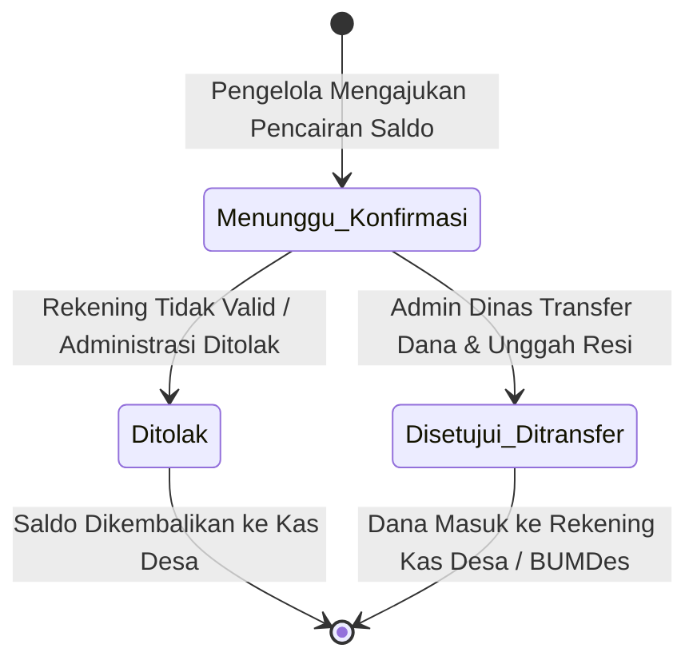
```mermaid
stateDiagram-v2
    [*] --> Menunggu_Konfirmasi : Pengelola Mengajukan Pencairan Saldo
    Menunggu_Konfirmasi --> Disetujui_Ditransfer : Admin Dinas Transfer Dana & Unggah Resi
    Menunggu_Konfirmasi --> Ditolak : Rekening Tidak Valid / Administrasi Ditolak
    Ditolak --> [*] : Saldo Dikembalikan ke Kas Desa
    Disetujui_Ditransfer --> [*] : Dana Masuk ke Rekening Kas Desa / BUMDes
```

---

## 10. Diagram Konteks & Aliran Data (DFD Level 0)

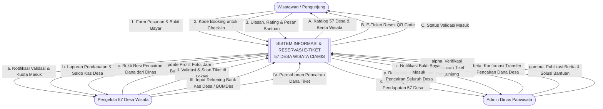
```mermaid
flowchart TD
    Wisatawan(["Wisatawan / Pengunjung"])
    Pengelola(["Pengelola 57 Desa Wisata"])
    Admin(["Admin Dinas Pariwisata"])
    
    System[["SISTEM INFORMASI & RESERVASI E-TIKET<br/>57 DESA WISATA CIAMIS"]]
    
    %% Aliran dari Wisatawan ke Sistem
    Wisatawan -- "1. Form Pesanan & Bukti Bayar" --> System
    Wisatawan -- "2. Kode Booking untuk Check-In" --> System
    Wisatawan -- "3. Ulasan, Rating & Pesan Bantuan" --> System
    
    %% Aliran dari Sistem ke Wisatawan
    System -- "A. Katalog 57 Desa & Berita Wisata" --> Wisatawan
    System -- "B. E-Ticket Resmi QR Code" --> Wisatawan
    System -- "C. Status Validasi Masuk" --> Wisatawan
    
    %% Aliran dari Pengelola Desa ke Sistem
    Pengelola -- "I. Update Profil, Foto, Jam Buka & Tarif Tiket" --> System
    Pengelola -- "II. Validasi & Scan Tiket di Lokasi" --> System
    Pengelola -- "III. Input Rekening Bank Kas Desa / BUMDes" --> System
    Pengelola -- "IV. Permohonan Pencairan Dana Tiket" --> System
    
    %% Aliran dari Sistem ke Pengelola Desa
    System -- "a. Notifikasi Validasi & Kuota Masuk" --> Pengelola
    System -- "b. Laporan Pendapatan & Saldo Kas Desa" --> Pengelola
    System -- "c. Bukti Resi Pencairan Dana dari Dinas" --> Pengelola
    
    %% Aliran dari Admin Dinas ke Sistem
    Admin -- "alpha. Verifikasi Pembayaran Tiket Pengunjung" --> System
    Admin -- "beta. Konfirmasi Transfer Pencairan Dana Desa" --> System
    Admin -- "gamma. Publikasi Berita & Solusi Bantuan" --> System
    
    %% Aliran dari Sistem ke Admin Dinas
    System -- "x. Monitoring Statistik & Pendapatan 57 Desa" --> Admin
    System -- "y. Rekapitulasi Pengajuan Pencairan Seluruh Desa" --> Admin
    System -- "z. Notifikasi Bukti Bayar Masuk" --> Admin
```

---
*Dokumen ini dibuat otomatis sebagai spesifikasi teknis dan artefak arsitektur sistem proyek **DewiCiamis** (Laravel 10).*
